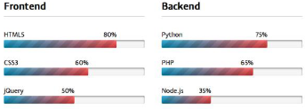

# Mini Piscine Python Django

# Imersão ao Linguagem Python através de listas conhecimento!

## Skills
- Object-oriented programming
- DB & Data
- Web
- Technology integration

## certificate

<table border="1" width="300">

   <tr>
    <td  align="center"colspan="4">Day00 - Familiarizar com os fundamentos do desenvolvimento web: 
        HTTP, HTML, css e integração de scripts Javascript existentes em suas páginas</td>
   </tr>
  
   <tr>
      <td align="center">Exercicios </td>
      <td align="center">Descrição </td>
  </tr>
  
   <tr>
    <td>Ex00</td>
    <td>Escrever e entregar um script de shell que exiba o endereço real de um endereço bit.ly supostamente válido 
        (ou seja, "o endereço para o qual o link bit.ly leva). 
        Conforme declarado no cabeçalho deste exercício, você só pode usar os seguintes comandos shell: 
        curl,grep e cut. Sua melhor aposta é começar a ler o manual do curl. 
        Para fazer isso, digite man curl no seu terminal. 
        Você deve usar /bin/sh como um interpretador.</td>
   </tr>
   
   <tr>
    <td>Ex01</td>
    <td>Você escreverá seu currículo em HTML/css respeitando as seguintes restrições:
    
    • Respeitar a semântica de suas tags HTML, bem como a separação entre estilo e conteúdo.
    • Criar um arquivo HTML consistente com o conteúdo mínimo necessário: nome,sobrenome, habilidades e plano de carreira.
    • Exibir pelo menos um título com a tag title e um título com a tag h1.
    • Usar pelo menos uma tabela com as tags table, th, tr e td.
    • Usar pelo menos uma lista com a tag ul e uma lista com a tag ol. Os elementos devem usar uma tag li.
    • As bordas da tabela devem estar visíveis (sólidas). As bordas da tabela devem ser mescladas (colapso).
    • A célula inferior direita de uma tabela deve ter a cor de borda #424242.
    • Usar uma solução sintática diferente para cada instrução anterior: para a primeira, use a tag style no cabeçalho de sua página.
      Para o segundo, use um atributo de estilo na tag que achar adequado.
   </tr>
  
  <tr>
    <td>Ex02</td>
    <td>Crie um formulário HTML que represente as informações usuais de qualquer contato. Essa forma mostrará os seguintes campos: 
        • Nome: um campo de texto. 
        • Sobrenome: também um campo de texto. 
        • Idade: você deve usar o campo numérico específico do HTML5. 
        • Telefone: deve-se utilizar o campo tel específico do HTML5. 
        • E-mail: você deve usar o campo de e-mail específico do HTML5. 
        • Aluno aos 42?: deve-se utilizar o campo checkbox. 
        • Sexo: você deve usar botões de opção com os valores Masculino, Feminino e Outro. 
        • Um botão de envio de formulário. O atributo onclick do seu botão deve ser: 'displayFormContent 
        
        Há um arquivo popup.js Javascript escrito pelo filho de seu chefe, que é estagiário em sua empresa.
        E como você não gostaria que o filho do seu chefe se sentisse um pateta incompetente no que
        diz respeito à programação, você não pode modificar o arquivo dele, que deve ser usado como está.
        
        Você deve integrar corretamente este arquivo Javascript em sua página HTML. Se o seu código
        HTML estiver correto, apertar o botão do formulário fará com que um pop-up supermoderno apareça.
        Ele conterá os campos e valores do seu formulário. Caso contrário, seu código HTML está com defeito.
        
        💡 Uma leitura completa e um entendimento superficial do código Javascript fornecido são
        necessários para concluir este exercício.
   </tr>
   
   <tr><td>Ex03</td>
       <td>Uma empresa concorrente carregou um site que é melhor do que o seu. Graças a uma séria missão de espionagem 
       industrial, seu chefe obtém uma captura de tela de uma página e seu arquivo css. 
           Deve replicar esta página o mais fielmente possível! 
            
           Mais uma vez, você terá que separar estilo e conteúdo, respeitar a semântica das tags que usará e manter 
           a estrutura lógica do seu documento.  
           Deve usar o arquivo css fornecido sem modificá-lo. Uma versão "nova" do css será usada durante a avaliação 
           para verificar se você seguiu este instrução.
   </tr>
   
   <tr><td>Ex04</td>
       <td>Há uma pasta que contém os mesmos 4 arquivos: arquivo1.js, arquivo2.js, arquivo3.js e arquivo4.js. 
           Crie um arquivo snippets.html que deve importar os 4 scripts para que o pop-up apareça corretamente 
           (o que significa que nenhum caractere estranho deve aparecer) 
 
           ⚠️ Não pode importar os scripts especificados. Você não pode modificá-los.
              Não pode adicionar Javascript em seu código HTML.</td>
   </tr>
   <tr><td>Ex05</td>
      <td>Código é legal. Código legal é melhor. E escreva um bom código, você deve seguir uma boa norma. 
      A norma W3C é básica e você deve respeitar sua forma ao escrever ou gerar HTML. 
      Há arquivos no diretório ex05.Ele contém as fontes de uma página web completa. Infelizmente, foi escrito por um 
      desenvolvedor muito menos habilidoso do que você! 
      Edite o código HTML do arquivo de índice html para que ele passe na validação do W3C! Isso não significa erro nem aviso. 
      Você deve editar o arquivo, não truncá-lo. Isso significa que o conteúdo do arquivo que você editará deve ser incluído em  
      sua totalidade em seu repo. 
      </td></tr>
   </table>
